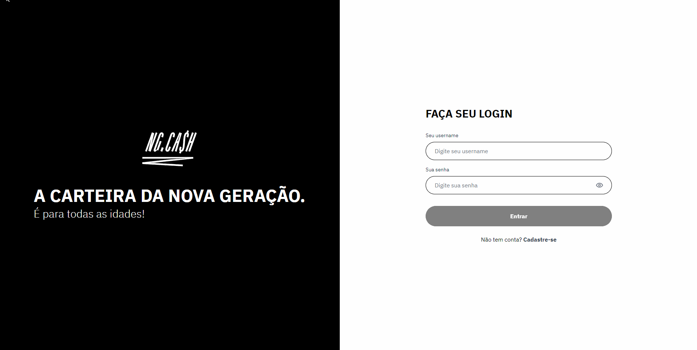

# NG.CASH | TECH CHALLENGE

> Aplicação web fullstack desenvolvida para o processo seletivo da **NG.CASH**. Abaixo você encontra as instruções para rodar o projeto e as regras de negócio utilizadas para desenvolver o frontend e o backend da aplicação.

<br/>



<br/>

## Instruções para rodar o projeto

Foi solicitada uma aplicação *dockerizada* com banco de dados PostgreSQL. Considerando que o docker já está configurado e iniciado em sua máquina, é importante verificar a variável de ambiente **DATABASE_URL** no arquivo **.env** dentro da pasta **server** e se necessário ajustar para se conectar corretamente com o banco de dados.

Após configurar o Docker, acesse a pasta **server**, instale as dependências e execute o servidor de desenvolvimento através do seu terminal (no exemplo abaixo foi utilizado o npm):

```bash
# acesse a pasta:
cd server

# instale as dependências:
npm install

# execute o servidor:
npm run dev
```

Em um novo terminal, acesse a pasta **web**, instale as dependências e execute o servidor de desenvolvimento para rodar o frontend (no exemplo abaixo foi utilizado o npm):

```bash
# acesse a pasta:
cd web

# instale as dependências:
npm install

# execute o servidor:
npm run dev
```

Abra [http://localhost:3000](http://localhost:3000) com seu navegador para começar a utilizar a aplicação.
## Regras de Negócio - Backend
- [x] Qualquer pessoa deverá poder fazer parte da NG. Para isso, basta realizar o cadastro informando *username* e *password*.
- [x] Deve-se garantir que cada *username* seja único e composto por, pelo menos, 3 caracteres.
- [x] Deve-se garantir que a *password* seja composta por pelo menos 8 caracteres, um número e uma letra maiúscula. Lembre-se que ela deverá ser *hashada* ao ser armazenada no banco.
- [x] Durante o processo de cadastro de um novo usuário, sua respectiva conta deverá ser criada automaticamente na tabela **Accounts** com um *balance* de R$ 100,00. É importante ressaltar que caso ocorra algum problema e o usuário não seja criado,  a tabela **Accounts** não deverá ser afetada.
- [x] Todo usuário deverá conseguir logar na aplicação informando *username* e *password.* Caso o login seja bem-sucedido, um token JWT (com 24h de validade) deverá ser fornecido.
- [x] Todo usuário logado (ou seja, que apresente um token válido) deverá ser capaz de visualizar seu próprio *balance* atual. Um usuário A não pode visualizar o *balance* de um usuário B, por exemplo.
- [x] Todo usuário logado (ou seja, que apresente um token válido) deverá ser capaz de realizar um *cash-out* informando o *username* do usuário que sofrerá o *cash-in*), caso apresente *balance* suficiente para isso. Atente-se ao fato de que um usuário não deverá ter a possibilidade de realizar uma transferência para si mesmo.
- [x] Toda nova transação bem-sucedida deverá ser registrada na tabela **Transactions**. Em casos de falhas transacionais, a tabela **Transactions** não deverá ser afetada.
- [x] Todo usuário logado (ou seja, que apresente um token válido) deverá ser capaz de visualizar as transações financeiras (*cash-out* e *cash-in*) que participou. Caso o usuário não tenha participado de uma determinada transação, ele nunca poderá ter acesso à ela.
- [x] Todo usuário logado (ou seja, que apresente um token válido) deverá ser capaz de filtrar as transações financeiras que participou por:
  - Data de realização da transação e/ou
    - Transações de *cash-out;*
    - Transações de *cash-in.*
## Regras de Negócio - Frontend
- [x] Página para realizar o cadastro na NG informando *username* e *password*.
- [x] Página para realizar o login informando *username* e *password*.
- Com o usuário logado, a página principal deve apresentar:
  - [x] *balance* atual do usuário;
  - [x] Seção voltada à realização de transferências para outros usuários NG a partir do *username* de quem sofrerá o *cash-in*;
  - [x] Tabela com os detalhes de todas as transações que o usuário participou;
  - [x] Mecanismo para filtrar a tabela por data de transação e/ou transações do tipo *cash-in/cash-out*;
  - [x] Botão para realizar o *log-out*.

## Tecnologias e ferramentas utilizadas
- Next.js
- Tailwind CSS
- TypeScript
- Node.js
- Prisma.ORM
- Docker
- Banco de dados PostgreSQL
- Formik
- Yup
- Zod
- Nookies
